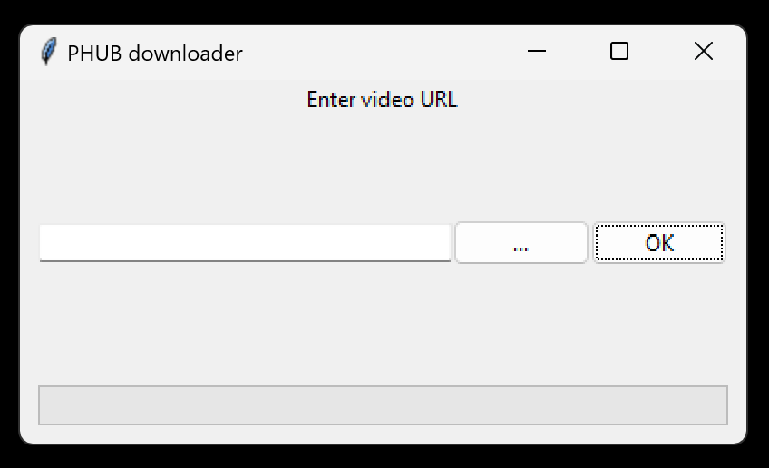

Using the CLI
=============

**PHUB** comes with a built-in CLI that allows
you to use the basic features directly from the
terminal. 

You can start the CLI by calling PHUB as a module:

.. code_block:: sh

    $ python -m phub
    Usage: python -m phub [OPTIONS] COMMAND [ARGS]...

    Options:
    --help  Show this message and exit.

    Commands:
    download  Download a specific video.
    ui        Run in UI mode.

Downloading videos
------------------

The most useful command is the ``download``
command. It takes a ``--url`` argument.

.. code_block:: sh

    $ python -m phub download --url <some_video_url>

You can also specify a custom quality and output.

.. code_block:: sh

    $ python -m phub download --url <some_video_url> \
                              --quality best \
                              --output some/file.mp4

Using the UI
------------

To simplifiate downloading even more, you can
also use a small UI.

.. code_block:: sh

    $ python -m phub ui

